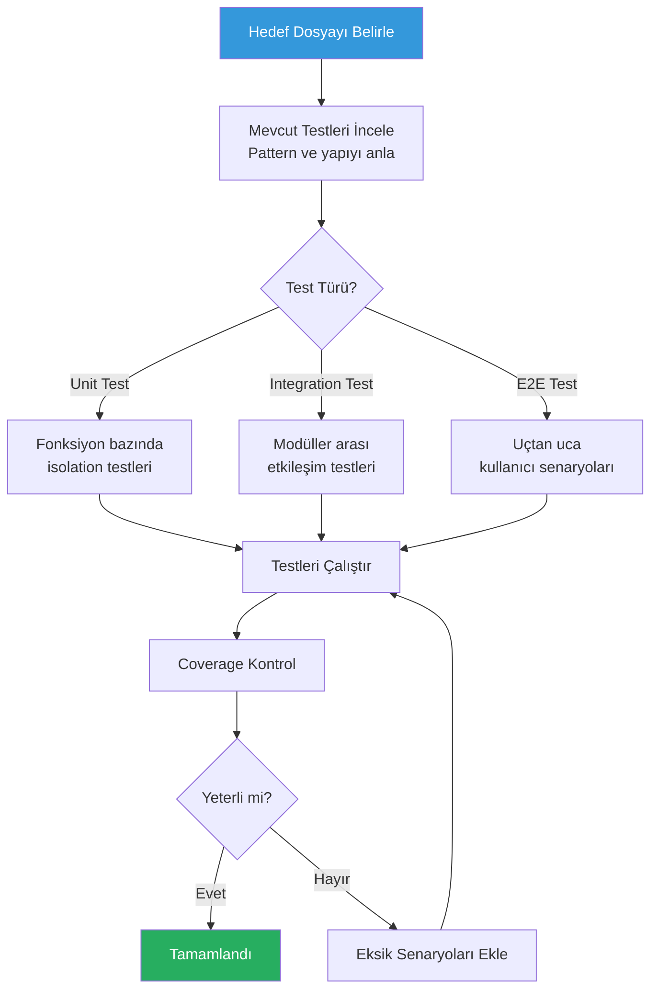
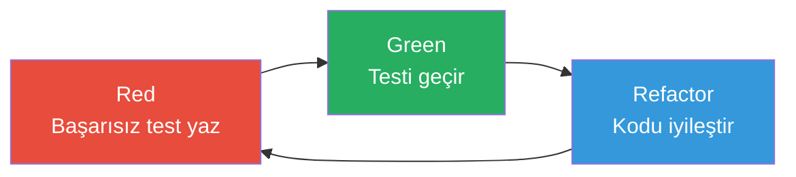

# Test Yazma

Test yazma, yazılım kalitesinin temel taşıdır. Claude Code, unit test (birim test), integration test (entegrasyon testi), coverage (kapsam) iyileştirme ve Test-Driven Development (test güdümlü geliştirme) iş akışlarını hızlandırır.

## Ön Koşullar

| Konu | Bölüm |
|------|-------|
| Claude Code araçları | [Bölüm 08](../08-araclar/README.md) |
| Refactoring | [Refactoring](./03-refactoring.md) |

---

## Test Yazma İş Akışı



---

## Unit Test Yazma

### Mevcut Pattern'e Uygun Test

```bash
# Mevcut test pattern'ini analiz et ve aynı tarzda yaz
claude "tests/ dizinindeki mevcut test dosyalarını incele. Kullanılan test framework'ü, assertion kütüphanesi, mock yapısı ve naming convention'ı belirle. Sonra src/services/order-service.ts dosyası için aynı pattern'de unit testler yaz."
```

### Kapsamlı Unit Test

```bash
# Tüm durumları kapsayan test
claude "src/utils/validator.ts dosyasındaki validateEmail fonksiyonu için kapsamlı unit testler yaz:
1. Geçerli email adresleri (en az 5 farklı format)
2. Geçersiz email adresleri (en az 8 farklı hata durumu)
3. Edge case'ler (boş string, null, undefined, çok uzun string)
4. Özel karakterler ve unicode
Her test case'e anlamlı açıklama ekle."
```

---

## Integration Test Yazma

```bash
# API integration test
claude "src/routes/users.ts dosyasındaki tüm endpoint'ler için integration testler yaz:
1. POST /api/users - Yeni kullanıcı oluşturma (başarılı + validation hataları)
2. GET /api/users/:id - Kullanıcı getirme (mevcut + bulunamadı)
3. PUT /api/users/:id - Güncelleme (başarılı + yetkisiz)
4. DELETE /api/users/:id - Silme (başarılı + bağımlılık hatası)

Test veritabanı kullan, her test sonrası temizle. supertest veya benzeri HTTP test kütüphanesi kullan."
```

---

## Test-Driven Development (TDD)

TDD döngüsünü Claude Code ile uygulama:



```bash
# TDD ile yeni feature geliştir
claude "TDD yaklaşımıyla DiscountCalculator sınıfı oluştur. Sırayla:

1. RED: Yüzdelik indirim testi yaz (başarısız olacak)
2. GREEN: Minimum kod ile testi geçir
3. REFACTOR: Kodu iyileştir

4. RED: Sabit tutarlı indirim testi yaz
5. GREEN: Testi geçir
6. REFACTOR: Kodu iyileştir

7. RED: Minimum tutar şartlı indirim testi yaz
8. GREEN: Testi geçir
9. REFACTOR: Son düzenleme

Her adımı sırayla uygula ve testleri çalıştır."
```

---

## Coverage İyileştirme

```bash
# Coverage raporu ve iyileştirme
claude "Test coverage raporunu çalıştır. Sonra:
1. Coverage'ı %80'in altında olan dosyaları listele
2. Her dosya için eksik test senaryolarını belirle
3. En düşük coverage'a sahip 3 dosya için testler yaz
4. Coverage'ı tekrar kontrol et"
```

```bash
# Belirli bir dosyanın coverage'ını artır
claude "src/services/payment-service.ts dosyasının test coverage'ı %45. Kapsanmayan satırları belirle ve testlerini yaz. Hedef: %85 coverage."
```

---

## Pratik Örnekler

### Örnek 1: React Component Testi

```bash
claude "src/components/LoginForm.tsx component'i için test yaz:
1. Doğru render edildiğini kontrol et
2. Email ve şifre alanları doldurulduğunda submit çalışıyor
3. Boş form submit edildiğinde validation hatası gösteriyor
4. API hatası geldiğinde hata mesajı gösteriyor
5. Loading durumunda buton disable oluyor
React Testing Library ve Jest kullan."
```

### Örnek 2: API Mock Testleri

```bash
claude "src/services/weather-service.ts dosyasındaki dış API çağrılarını mock'layarak test yaz:
1. Başarılı API yanıtı
2. 404 hatası
3. 500 hatası
4. Timeout durumu
5. Rate limiting (429) yanıtı
Her durum için uygun error handling'in çalıştığını doğrula."
```

### Örnek 3: Veritabanı Test

```bash
claude "Repository katmanı için veritabanı testleri yaz. Test veritabanı kullan (SQLite in-memory veya test container). Her test:
1. Setup: Test verisi oluştur
2. Execute: İşlemi gerçekleştir
3. Assert: Sonucu doğrula
4. Teardown: Verileri temizle

Transaction rollback ile izolasyon sağla."
```

---

## Test Kontrol Listesi

| Kontrol | Açıklama |
|---------|----------|
| Happy path | Normal akış test edildi mi? |
| Error cases | Hata durumları test edildi mi? |
| Edge cases | Sınır değerler test edildi mi? |
| Null/undefined | Boş değerler handle ediliyor mu? |
| Concurrent access | Eşzamanlı erişim test edildi mi? |
| Mock isolation | Dış bağımlılıklar mock'landı mı? |
| Cleanup | Test sonrası temizlik yapılıyor mu? |

---

## Özet

| Test Türü | Claude Code Katkısı |
|-----------|---------------------|
| **Unit Test** | Fonksiyon bazında izole test |
| **Integration Test** | Modüller arası etkileşim testi |
| **TDD** | Red-Green-Refactor döngüsü |
| **Coverage** | Eksik kapsam tespiti ve test ekleme |
| **Mock** | Dış bağımlılık simülasyonu |

---

## Sonraki Adım

Projenin dokümantasyonunu otomatik oluşturma:

→ [Dokümantasyon Oluşturma](./05-dokumantasyon-olusturma.md)
