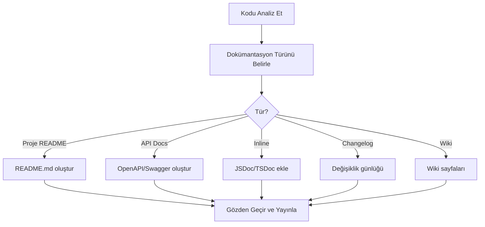

# Dokümantasyon Oluşturma

İyi dokümantasyon, projenin sürdürülebilirliğinin temelidir. Claude Code, README oluşturma, API dokümantasyonu, inline comment'ler, changelog (değişiklik günlüğü) ve wiki sayfaları gibi tüm dokümantasyon ihtiyaçlarını otomatize eder.

## Ön Koşullar

| Konu | Bölüm |
|------|-------|
| Claude Code araçları | [Bölüm 08](../08-araclar/README.md) |
| Proje keşfetme | [Proje Keşfetme](./01-proje-kesfetme.md) |

---

## Dokümantasyon İş Akışı



---

## README Oluşturma

```bash
# Kapsamlı README oluştur
claude "Bu proje için profesyonel bir README.md oluştur. İçeriği:
1. Proje adı ve açıklaması (kısa ve etkileyici)
2. Özellikler listesi (bullet point)
3. Teknoloji stack'i (logolarla)
4. Kurulum adımları (detaylı)
5. Kullanım örnekleri (terminal çıktılarıyla)
6. Ortam değişkenleri tablosu
7. API endpoint'leri (özet tablo)
8. Proje yapısı (dizin ağacı)
9. Katkıda bulunma rehberi
10. Lisans
GitHub'da güzel görünsün."
```

---

## API Dokümantasyonu

```bash
# OpenAPI spec oluştur
claude "Bu projedeki tüm API endpoint'lerini analiz et ve OpenAPI 3.0 (Swagger) spesifikasyonu oluştur:
- Her endpoint için: HTTP method, path, açıklama
- Request body schema (örnek ile)
- Response schema (200, 400, 401, 404, 500)
- Authentication gereksinimi
- Query parameter'lar
docs/openapi.yaml olarak kaydet."
```

```bash
# API kullanım örnekleri oluştur
claude "Her API endpoint'i için curl ve JavaScript (fetch) kullanım örnekleri oluştur. Request ve response body'lerini gerçekçi örnek verilerle göster."
```

---

## Inline Documentation (Satır İçi Dokümantasyon)

```bash
# JSDoc/TSDoc ekle
claude "src/services/ dizinindeki tüm public fonksiyonlara JSDoc dokümantasyonu ekle:
- @description: Fonksiyonun ne yaptığı
- @param: Her parametre (tip ve açıklama)
- @returns: Dönüş değeri
- @throws: Fırlatılan hatalar
- @example: Kullanım örneği

Mevcut kodu değiştirme, sadece dokümantasyon ekle."
```

---

## Changelog Oluşturma

```bash
# Git geçmişinden changelog oluştur
claude "Git commit geçmişini analiz ederek CHANGELOG.md oluştur. Conventional Commits formatını takip et:
- feat: Yeni özellikler
- fix: Hata düzeltmeleri
- refactor: Yeniden yapılandırma
- docs: Dokümantasyon
- chore: Bakım işleri

Semantic versioning ile sürüm numaraları belirle. En son sürümden geriye doğru listele."
```

---

## Wiki ve Teknik Dokümantasyon

```bash
# Mimari dokümantasyonu oluştur
claude "Bu projenin mimari dokümantasyonunu oluştur. docs/architecture.md olarak kaydet:
1. Sistem genel görünümü (mermaid diagram)
2. Katman yapısı ve sorumlulukları
3. Veri akışı (request lifecycle)
4. Veritabanı ER diyagramı
5. Dış sistem entegrasyonları
6. Dağıtım (deployment) mimarisi"
```

```bash
# Onboarding rehberi
claude "Yeni katılan geliştiriciler için onboarding rehberi oluştur:
1. Geliştirme ortamı kurulumu (adım adım)
2. Projeyi çalıştırma
3. İlk görev: basit bir bug fix walkthrough
4. Kod standartları ve kurallar
5. PR süreci
6. Faydalı komutlar ve kısayollar"
```

---

## Pratik Örnekler

### Örnek 1: Package Dokümantasyonu

```bash
claude "Bu npm paketi için dokümantasyon oluştur:
1. README.md (kurulum, kullanım, API referansı)
2. CONTRIBUTING.md (katkı rehberi)
3. Her public export için kullanım örneği
4. TypeScript tip dokümantasyonu"
```

### Örnek 2: Veritabanı Dokümantasyonu

```bash
claude "Veritabanı schema'sını analiz ederek dokümantasyon oluştur:
1. ER diyagramı (mermaid)
2. Tablo bazında: alan adları, tipler, açıklamalar, kısıtlamalar
3. İndeksler ve performans notları
4. Migration geçmişi özeti"
```

### Örnek 3: Mevcut Dokümanları Güncelle

```bash
claude "README.md dosyasını mevcut kodla karşılaştır. Güncel olmayan kısımları bul ve güncelle:
1. Eklenen ama dokümante edilmemiş endpoint'ler
2. Değişen kurulum adımları
3. Yeni ortam değişkenleri
4. Kaldırılan özellikler"
```

---

## Özet

| Dokümantasyon Türü | Claude Code Katkısı |
|--------------------|---------------------|
| **README** | Kapsamlı proje tanıtımı oluşturma |
| **API Docs** | OpenAPI spec ve kullanım örnekleri |
| **Inline** | JSDoc/TSDoc otomatik ekleme |
| **Changelog** | Git geçmişinden otomatik oluşturma |
| **Wiki** | Mimari ve onboarding rehberi |

---

## Sonraki Adım

Sıfırdan komple bir proje oluşturma:

→ [Sıfırdan Proje Oluşturma](./06-sifirdan-proje-olusturma.md)
