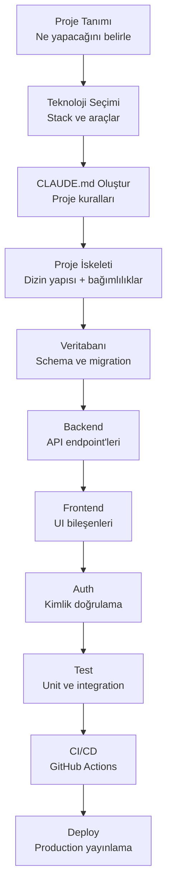

# Sıfırdan Proje Oluşturma

Sıfırdan bir proje başlatmak, Claude Code'un en güçlü olduğu alanlardan biridir. Dizin yapısı, bağımlılıklar, boilerplate (iskelet) kod, CI/CD ve dokümantasyon dahil olmak üzere tüm proje altyapısını oluşturabilirsiniz.

## Ön Koşullar

| Konu | Bölüm |
|------|-------|
| Claude Code temelleri | [Bölüm 06](../06-claude-code-tanitim/README.md) |
| CLAUDE.md | [CLAUDE.md Dosyası](../09-bellek-ve-baglam/01-claude-md-dosyasi.md) |

---

## Proje Oluşturma İş Akışı



---

## Adım Adım: Full Stack Web App

Bir görev yönetim uygulaması (TaskBoard) oluşturalım:

### Adım 1: Proje Tanımı ve CLAUDE.md

```bash
claude "TaskBoard adında bir görev yönetim uygulaması başlatacağız. Önce CLAUDE.md dosyasını oluştur:

Teknoloji: Next.js 15, TypeScript, Tailwind CSS, Prisma ORM, PostgreSQL
Özellikler: Proje yönetimi, görev takibi, kullanıcı yetkilendirme
Kurallar: TypeScript strict, ESLint, Prettier, conventional commits

CLAUDE.md dosyasını oluştur ve proje dizin yapısını belirle."
```

### Adım 2: Proje İskeleti

```bash
claude "Next.js 15 projesi oluştur. TypeScript, Tailwind CSS, ESLint ve Prettier konfigüre et. App Router kullan. Şu dizin yapısını oluştur:

src/
├── app/              # Sayfalar
│   ├── (auth)/       # Login, Register
│   ├── dashboard/    # Ana sayfa
│   └── api/          # API Routes
├── components/       # UI bileşenleri
│   ├── ui/           # Temel UI (Button, Input, Modal)
│   └── features/     # İş mantığı bileşenleri
├── lib/              # Utility ve konfigürasyon
├── db/               # Prisma schema ve seed
└── types/            # TypeScript tipleri

Gerekli tüm paketleri yükle ve çalışır duruma getir."
```

### Adım 3: Veritabanı

```bash
claude "Prisma ORM ile veritabanı schema'sını oluştur:

User: id, name, email, password_hash, avatar, role, created_at
Project: id, name, description, owner_id, color, created_at
Task: id, title, description, status, priority, project_id, assignee_id, reporter_id, due_date, created_at, updated_at
Comment: id, content, task_id, author_id, created_at

Enum'lar:
- TaskStatus: BACKLOG, TODO, IN_PROGRESS, REVIEW, DONE
- TaskPriority: LOW, MEDIUM, HIGH, URGENT
- UserRole: ADMIN, MEMBER, VIEWER

İlişkileri kur, migration çalıştır ve seed data ekle."
```

### Adım 4: Backend API

```bash
claude "API Routes oluştur:

/api/auth/register - POST (kayıt)
/api/auth/login - POST (giriş)
/api/projects - GET, POST
/api/projects/[id] - GET, PUT, DELETE
/api/projects/[id]/tasks - GET, POST
/api/tasks/[id] - GET, PUT, DELETE
/api/tasks/[id]/comments - GET, POST

Her endpoint'te: input validation (Zod), error handling, authentication kontrolü. Prisma ile veritabanı işlemleri."
```

### Adım 5: Frontend

```bash
claude "Dashboard sayfasını oluştur:
1. Sol sidebar: proje listesi, navigation
2. Üst bar: arama, bildirimler, kullanıcı menüsü
3. Ana alan: Kanban board (sürükle-bırak ile)
4. Sağ panel: görev detayı (tıklandığında)

Tailwind CSS ile modern, responsive tasarım. Dark mode desteği. Loading skeleton'lar ve boş durum görselleri."
```

### Adım 6: Authentication

```bash
claude "NextAuth.js ile authentication ekle:
1. Email/şifre ile kayıt ve giriş
2. JWT session yönetimi
3. Korumalı route'lar (middleware)
4. Login ve Register sayfaları
5. Kullanıcı profil sayfası"
```

### Adım 7: Testler

```bash
claude "Proje için testler yaz:
1. API endpoint'leri için integration testler (Vitest + supertest)
2. UI bileşenleri için component testler (Testing Library)
3. Prisma veritabanı işlemleri için unit testler
4. Test config ve scripts'i package.json'a ekle"
```

### Adım 8: CI/CD

```bash
claude "GitHub Actions CI/CD pipeline'ı oluştur:

.github/workflows/ci.yml:
- Push ve PR'da çalışsın
- Lint kontrolü
- Type check
- Unit testler
- Integration testler
- Build kontrolü

.github/workflows/deploy.yml:
- main branch'e merge'de çalışsın
- Vercel'e otomatik deploy"
```

### Adım 9: Dokümantasyon ve Deploy

```bash
claude "Projeyi tamamla:
1. Kapsamlı README.md oluştur
2. .env.example dosyası hazırla
3. CONTRIBUTING.md oluştur
4. API dokümantasyonu oluştur
5. Vercel deploy konfigürasyonu"
```

---

## Proje Oluşturma Kontrol Listesi

```mermaid
flowchart LR
    A["Proje Yapısı<br/>✅ Dizinler"] --> B["Bağımlılıklar<br/>✅ package.json"]
    B --> C["Veritabanı<br/>✅ Schema + Seed"]
    C --> D["API<br/>✅ Endpoints"]
    D --> E["Frontend<br/>✅ Sayfalar"]
    E --> F["Auth<br/>✅ Login/Register"]
    F --> G["Testler<br/>✅ Unit + Integration"]
    G --> H["CI/CD<br/>✅ GitHub Actions"]
    H --> I["Docs<br/>✅ README + API"]
    I --> J["Deploy<br/>✅ Production"]
```



| Kontrol | Dosya/Dizin |
|---------|-------------|
| Proje kuralları | `CLAUDE.md` |
| Bağımlılıklar | `package.json` |
| TypeScript | `tsconfig.json` |
| Linting | `.eslintrc.js`, `.prettierrc` |
| Ortam değişkenleri | `.env.example` |
| Git | `.gitignore` |
| Veritabanı | `prisma/schema.prisma` |
| CI/CD | `.github/workflows/` |
| Dokümantasyon | `README.md` |
| Docker | `Dockerfile`, `docker-compose.yml` |

---

## Özet

| Aşama | Claude Code Katkısı |
|-------|---------------------|
| **İskelet** | Dizin yapısı ve boilerplate |
| **Veritabanı** | Schema, migration, seed |
| **Backend** | API endpoint'leri ve validation |
| **Frontend** | UI bileşenleri ve sayfalar |
| **Auth** | Kimlik doğrulama sistemi |
| **Test** | Unit ve integration testler |
| **CI/CD** | GitHub Actions pipeline |
| **Deploy** | Production hazırlığı |

---

## Sonraki Adım

API geliştirme detayları ve best practice'ler:

→ [API Geliştirme](./07-api-gelistirme.md)
