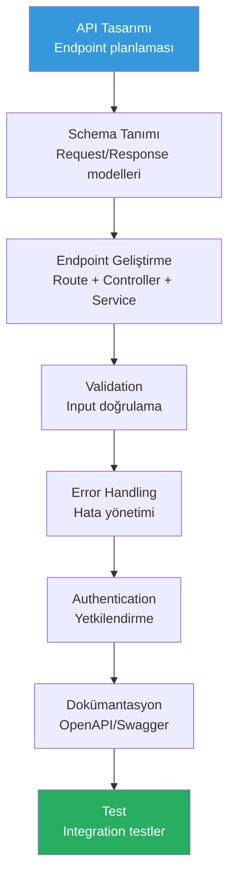

# API Geliştirme

API (Application Programming Interface) geliştirme, modern yazılımın temel yapı taşlarından biridir. Claude Code, REST ve GraphQL API tasarımından endpoint tanımlamaya, validation'dan error handling'e, dokümantasyondan test yazmaya kadar tüm API geliştirme sürecini hızlandırır.

## Ön Koşullar

| Konu | Bölüm |
|------|-------|
| Claude Code araçları | [Bölüm 08](../08-araclar/README.md) |
| Sıfırdan proje oluşturma | [Sıfırdan Proje](./06-sifirdan-proje-olusturma.md) |

---

## API Geliştirme İş Akışı



---

## REST API Geliştirme

### Endpoint Tasarımı

```bash
# RESTful API endpoint'lerini tasarla
claude "E-ticaret uygulaması için RESTful API endpoint'lerini tasarla. Kaynaklar: products, categories, orders, users. Her kaynak için:
1. CRUD endpoint'leri (GET, POST, PUT, DELETE)
2. İlişkisel endpoint'ler (GET /products/:id/reviews)
3. Filtreleme ve sayfalama (query parameters)
4. HTTP status code'ları
5. URL yapısı (RESTful naming convention)
Endpoint'leri tablo olarak listele."
```

### Endpoint Geliştirme

```bash
# CRUD endpoint'leri oluştur
claude "Products kaynağı için Express.js endpoint'leri oluştur:

GET    /api/products         - Liste (sayfalama, filtreleme, sıralama)
GET    /api/products/:id     - Detay
POST   /api/products         - Oluştur
PUT    /api/products/:id     - Güncelle
DELETE /api/products/:id     - Sil
GET    /api/products/:id/reviews - Ürün yorumları

Her endpoint için: controller, service, repository katmanları. Zod validation, error handling ve response format tutarlılığı."
```

### Input Validation

```bash
# Zod ile validation schema'ları
claude "Tüm API endpoint'leri için Zod validation schema'ları oluştur:
1. CreateProductSchema (name: string, price: number, category_id, description)
2. UpdateProductSchema (partial, en az bir alan zorunlu)
3. ProductQuerySchema (page, limit, sort, filter, search)
4. Her schema için TypeScript tip çıkarımı (z.infer)
Validation hata mesajları Türkçe olsun."
```

### Error Handling

```bash
# Merkezi hata yönetimi
claude "Merkezi error handling sistemi oluştur:
1. AppError sınıfı (statusCode, message, errorCode, details)
2. Error middleware (Express error handler)
3. async wrapper (try/catch'i otomatik yapan)
4. Standart hata response formatı: { success: false, error: { code, message, details } }
5. HTTP status code mapping (400, 401, 403, 404, 409, 422, 500)
Her hata türü için örnek response göster."
```

---

## GraphQL API Geliştirme

```bash
# GraphQL schema ve resolver'lar
claude "Apollo Server ile GraphQL API oluştur:

Type'lar: User, Product, Order, Review
Query'ler: products, product(id), orders, userProfile
Mutation'lar: createProduct, updateProduct, deleteProduct, createOrder
Subscription'lar: orderStatusChanged

Her type için: schema tanımı, resolver, data loader (N+1 problemi çözümü). Error handling ve authentication middleware ekle."
```

---

## API Güvenliği

```bash
# Authentication ve Authorization
claude "API güvenlik katmanı ekle:
1. JWT authentication middleware
2. Role-based access control (RBAC): admin, user, guest
3. Rate limiting (express-rate-limit)
4. CORS konfigürasyonu
5. Helmet.js güvenlik header'ları
6. Input sanitization (XSS koruması)
Her endpoint için gerekli yetki seviyesini belirle."
```

---

## API Dokümantasyonu

```bash
# Swagger/OpenAPI oluştur
claude "Tüm API endpoint'leri için Swagger dokümantasyonu oluştur. swagger-jsdoc ve swagger-ui-express kullan. Her endpoint için:
1. Açıklama ve özet
2. Request body örneği
3. Response örnekleri (başarılı + hata)
4. Authentication gereksinimi
5. Query parameter açıklamaları
/api/docs adresinde erişilebilir olsun."
```

---

## Pratik Örnekler

### Örnek 1: Sayfalama ve Filtreleme

```bash
claude "Products endpoint'ine gelişmiş sayfalama ve filtreleme ekle:
- Cursor-based pagination (offset yerine)
- Filtreleme: category, minPrice, maxPrice, inStock
- Sıralama: price_asc, price_desc, name_asc, created_desc
- Arama: name ve description'da full-text search
Response format: { data: [], meta: { cursor, hasMore, total } }"
```

### Örnek 2: File Upload API

```bash
claude "Dosya yükleme endpoint'i oluştur:
POST /api/upload - Tek dosya yükleme
POST /api/upload/bulk - Çoklu dosya yükleme
- Multer ile dosya işleme
- Dosya boyutu limiti (5MB)
- İzin verilen tipler: jpg, png, pdf
- S3 veya local storage
- Thumbnail oluşturma (resimler için)"
```

### Örnek 3: Webhook Sistemi

```bash
claude "Webhook notification sistemi oluştur:
POST /api/webhooks - Webhook kaydet (URL, events)
DELETE /api/webhooks/:id - Webhook sil
POST /api/webhooks/test - Test webhook gönder

Webhook events: order.created, order.updated, payment.completed
Retry mekanizması: 3 deneme, exponential backoff
Signature verification: HMAC-SHA256"
```

### Örnek 4: API Versioning

```bash
claude "API versioning stratejisi uygula:
- URL-based: /api/v1/products, /api/v2/products
- v1 ve v2 arasındaki farkları yönet
- Deprecation header'ları
- Version routing middleware
- Geriye uyumluluk kuralları"
```

### Örnek 5: API Test

```bash
claude "Tüm API endpoint'leri için integration testleri yaz:
- Her endpoint için: başarılı senaryo + hata senaryoları
- Authentication testleri (token ile, token olmadan, geçersiz token)
- Validation testleri (eksik alan, geçersiz veri tipi)
- Edge case testleri (boş liste, bulunamayan kayıt)
supertest ve Jest kullan."
```

---

## Özet

| Alan | Claude Code Katkısı |
|------|---------------------|
| **Tasarım** | RESTful endpoint planlaması |
| **Geliştirme** | Controller, Service, Repository katmanları |
| **Validation** | Zod schema'ları ve tip güvenliği |
| **Error Handling** | Merkezi hata yönetimi |
| **Güvenlik** | JWT, RBAC, rate limiting |
| **Dokümantasyon** | Swagger/OpenAPI otomatik oluşturma |
| **Test** | Integration test yazma |

---

## Sonraki Adım

Veritabanı işlemleri ve schema yönetimi:

→ [Veritabanı İşlemleri](./08-veritabani-islemleri.md)
