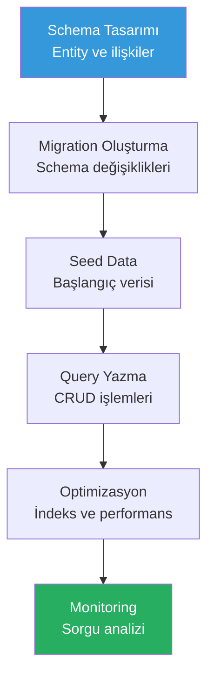
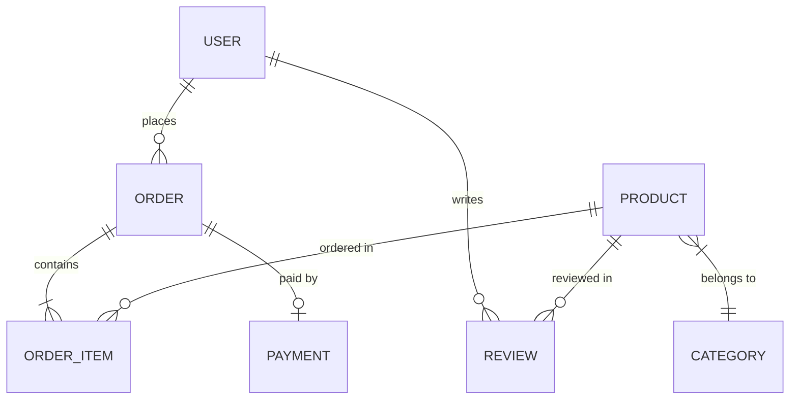

# Veritabanı İşlemleri

Veritabanı işlemleri — migration (göç) oluşturma, schema (şema) tasarımı, query optimization (sorgu optimizasyonu) ve seeding (başlangıç verisi) — yazılım geliştirmenin kritik adımlarıdır. Claude Code, bu süreçleri hızlandırır ve hata oranını düşürür.

## Ön Koşullar

| Konu | Bölüm |
|------|-------|
| Claude Code araçları | [Bölüm 08](../08-araclar/README.md) |
| API geliştirme | [API Geliştirme](./07-api-gelistirme.md) |

---

## Veritabanı İş Akışı



---

## Schema Tasarımı

```bash
# ER diyagramı ve schema tasarımı
claude "E-ticaret uygulaması için veritabanı schema'sı tasarla. Entity'ler:
- User (kullanıcı bilgileri, adresler)
- Product (ürün detayları, varyantlar)
- Category (hiyerarşik kategori yapısı)
- Order (sipariş ve sipariş kalemleri)
- Payment (ödeme kayıtları)
- Review (ürün değerlendirmeleri)

Her entity için: alanlar, tipler, constraint'ler, indeksler. Entity ilişkilerini mermaid ER diyagramı ile göster. Normalizasyon seviyesini belirt."
```



---

## Migration Oluşturma

### Prisma ile Migration

```bash
# Yeni tablo migration'ı
claude "Prisma schema'ya yeni bir 'notifications' tablosu ekle:
- id: UUID, primary key
- user_id: foreign key (User)
- type: enum (EMAIL, SMS, PUSH, IN_APP)
- title: string
- content: text
- read: boolean, default false
- created_at: datetime

Migration oluştur ve çalıştır. Mevcut veriyi bozmadığından emin ol."
```

### Güvenli Migration

```bash
# Breaking change olmadan migration
claude "products tablosuna 'slug' alanı eklemem gerekiyor. Bu değişikliği zero-downtime migration olarak planla:
1. Adım 1: Nullable slug alanını ekle
2. Adım 2: Mevcut ürünler için slug oluşturan data migration yaz
3. Adım 3: slug alanını NOT NULL yap ve unique index ekle
Her adım için ayrı migration oluştur. Rollback stratejisini de belirt."
```

---

## Seed Data

```bash
# Gerçekçi test verisi
claude "Veritabanı için gerçekçi seed data oluştur:
- 10 kullanıcı (farklı roller: admin, user)
- 5 kategori (hiyerarşik)
- 50 ürün (farklı kategorilerde, fiyat aralıklarında)
- 20 sipariş (farklı durumlarda: pending, paid, shipped, delivered)
- 30 yorum (1-5 yıldız dağılımı)
Faker.js kullan. Seed script'i idempotent olsun (tekrar çalıştırıldığında hata vermesin)."
```

---

## Query Optimizasyonu

```bash
# Yavaş sorgu analizi
claude "Bu projedeki veritabanı sorgularını analiz et. Şunları kontrol et:
1. N+1 sorgu problemi var mı? (eager loading eksik)
2. İndekslenmemiş alanlarla filtreleme yapılıyor mu?
3. Gereksiz SELECT * kullanımı var mı?
4. JOIN optimizasyonu gerekiyor mu?
5. Sayfalama düzgün uygulanmış mı? (offset vs cursor)
Her bulgu için sorgu planını göster ve optimize edilmiş versiyonu yaz."
```

```bash
# İndeks önerisi
claude "Bu veritabanının sorgularını analiz et ve gerekli indeksleri öner:
1. Sık sorgulanan alanlar
2. WHERE clause'larda kullanılan alanlar
3. JOIN koşullarındaki alanlar
4. ORDER BY alanları
5. Composite index gerektiren sorgular
Her indeks için: tür (B-tree, Hash, GIN), tahmini performans kazancı ve alan maliyeti."
```

---

## Pratik Örnekler

### Örnek 1: Hiyerarşik Veri

```bash
claude "Kategori tablosu için hiyerarşik yapı oluştur (self-referencing):
- Sınırsız derinlikte alt kategori desteği
- Breadcrumb sorgusu (kök → alt kategori yolu)
- Bir kategorinin tüm alt kategorilerini getiren recursive sorgu
- Materialized path veya closure table yaklaşımını karşılaştır ve uygun olanı uygula"
```

### Örnek 2: Soft Delete

```bash
claude "Tüm tablolara soft delete (mantıksal silme) desteği ekle:
- deleted_at: nullable datetime alanı
- Global scope/middleware: silinen kayıtları otomatik filtrele
- Kalıcı silme fonksiyonu (GDPR uyumlu)
- Geri yükleme fonksiyonu
- Cascade soft delete (ilişkili kayıtlar)"
```

### Örnek 3: Audit Log

```bash
claude "Veritabanı değişikliklerini izleyen audit log sistemi oluştur:
- audit_logs tablosu: entity_type, entity_id, action (CREATE/UPDATE/DELETE), old_values, new_values, user_id, timestamp
- Prisma middleware ile otomatik loglama
- Değişiklik karşılaştırma (diff) fonksiyonu
- Belirli bir kaydın değişiklik geçmişini sorgulama"
```

### Örnek 4: Full-Text Search

```bash
claude "Ürün arama için full-text search implementasyonu:
- PostgreSQL tsvector/tsquery kullanarak
- Arama indeksi oluştur (name, description alanlarında)
- Türkçe dil desteği
- Relevance scoring (sıralama)
- Arama önerisi (suggestion)"
```

---

## Veritabanı Kontrol Listesi

| Kontrol | Açıklama |
|---------|----------|
| Schema doğrulama | Alanlar doğru tipte mi? |
| Foreign key | İlişkiler tanımlı mı? |
| İndeksler | Sık sorgulanan alanlar indeksli mi? |
| Migration | Geri alınabilir (reversible) mi? |
| Seed data | Test verisi yeterli mi? |
| N+1 | Eager loading doğru mu? |
| Connection pool | Bağlantı havuzu ayarlı mı? |

---

## Özet

| İşlem | Claude Code Katkısı |
|-------|---------------------|
| **Schema** | ER diyagramı ve tablo tasarımı |
| **Migration** | Güvenli, geri alınabilir migration |
| **Seed** | Gerçekçi test verisi |
| **Optimizasyon** | Sorgu analizi ve indeks önerisi |
| **Gelişmiş** | Hiyerarşi, audit, full-text search |

---

## Sonraki Adım

Performans darboğazlarını tespit etme ve optimizasyon:

→ [Performans Optimizasyonu](./09-performans-optimizasyonu.md)
