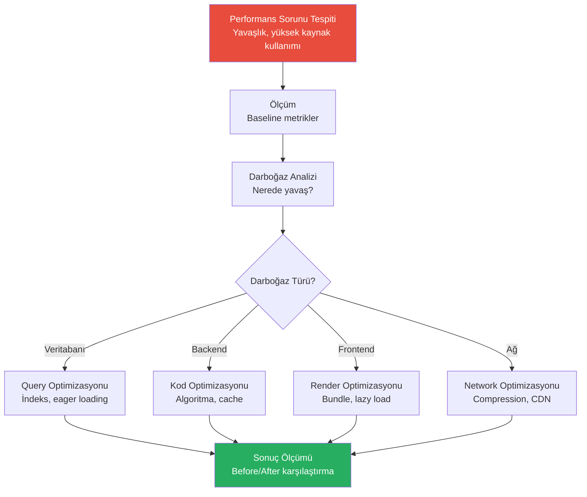

# Performans Optimizasyonu

Performans optimizasyonu, uygulamanın darboğazlarını tespit etme, profiling (profil çıkarma), iyileştirme ve sonuçları karşılaştırma sürecidir. Claude Code, kod analizi yaparak potansiyel performans sorunlarını tespit eder ve somut çözümler önerir.

## Ön Koşullar

| Konu | Bölüm |
|------|-------|
| Claude Code araçları | [Bölüm 08](../08-araclar/README.md) |
| Veritabanı işlemleri | [Veritabanı İşlemleri](./08-veritabani-islemleri.md) |

---

## Optimizasyon İş Akışı



---

## Darboğaz Tespiti

```bash
# Genel performans analizi
claude "Bu projenin performans açısından potansiyel sorunlarını analiz et:
1. Veritabanı: N+1 sorguları, indeks eksiklikleri, yavaş sorgular
2. Backend: Senkron bloklamalar, bellek sızıntıları, gereksiz hesaplamalar
3. Frontend: Bundle boyutu, gereksiz re-render, büyük resimler
4. Ağ: Sıkıştırma eksikliği, cache eksikliği, çok fazla HTTP isteği
Her bulgu için: etki seviyesi (yüksek/orta/düşük), tahmini iyileştirme ve çözüm önerisi."
```

---

## Veritabanı Optimizasyonu

```bash
# Sorgu optimizasyonu
claude "Bu projedeki veritabanı sorgularını analiz et:
1. EXPLAIN ANALYZE ile en yavaş 5 sorguyu tespit et
2. Her sorgu için: mevcut çalışma süresi, neden yavaş, optimize edilmiş versiyon
3. Eksik indeksleri belirle
4. N+1 sorunlarını bul ve eager loading ile düzelt
5. Connection pool ayarlarını optimize et

Before/After olarak performans karşılaştırması göster."
```

---

## Backend Optimizasyonu

```bash
# Kod performans analizi
claude "Backend kodunu performans açısından analiz et:
1. Senkron bloklayan operasyonlar (file I/O, hesaplama)
2. Memory leak potansiyeli (büyüyen array, kapatılmayan bağlantı)
3. Cache kullanılabilecek noktalar
4. Paralel çalışabilecek ama seri çalışan operasyonlar
5. Gereksiz veri kopyalama/dönüştürme
Her bulgu için optimize edilmiş kodu yaz."
```

### Cache Stratejisi

```bash
# Redis cache implementasyonu
claude "Sık sorgulanan veriler için Redis cache katmanı ekle:
1. Product listesi: 5 dakika TTL
2. Kategori ağacı: 1 saat TTL
3. Kullanıcı profili: 10 dakika TTL
Cache invalidation stratejisi: write-through veya write-behind. Cache miss durumunda veritabanından yükle ve cache'le."
```

---

## Frontend Optimizasyonu

```bash
# Bundle analizi ve optimizasyon
claude "Frontend bundle boyutunu analiz et ve optimize et:
1. Bundle analyzer ile büyük paketleri tespit et
2. Tree shaking düzgün çalışıyor mu?
3. Dynamic import ile code splitting uygula
4. Gereksiz bağımlılıkları kaldır veya daha hafif alternatiflere geç
5. Image optimizasyonu (next/image, WebP, lazy loading)
Before/After bundle boyutunu karşılaştır."
```

```bash
# React render optimizasyonu
claude "React uygulamasında gereksiz re-render'ları bul ve düzelt:
1. React.memo ile component memoization
2. useMemo ve useCallback doğru kullanılıyor mu?
3. Context kaynaklı gereksiz render
4. Virtualization gerektiren uzun listeler
5. Suspense ve lazy loading uygulaması"
```

---

## Network Optimizasyonu

```bash
# HTTP optimizasyonu
claude "Network performansını optimize et:
1. Gzip/Brotli sıkıştırma aktif mi?
2. HTTP/2 kullanılıyor mu?
3. Cache-Control header'ları doğru ayarlanmış mı?
4. Static asset'ler CDN'den sunuluyor mu?
5. API yanıt boyutlarını küçült (sparse fieldset, pagination)
Her optimizasyon için tahmini kazancı belirt."
```

---

## Pratik Örnekler

### Örnek 1: API Response Süresi

```bash
claude "GET /api/products endpoint'i 2 saniyede yanıt veriyor. Kabul edilebilir süre 200ms. Analiz et:
1. Veritabanı sorgusu ne kadar sürüyor?
2. Serialization overhead var mı?
3. Middleware zinciri optimize edilebilir mi?
4. Cache eklenebilir mi?
Adım adım optimize et ve her adımda ölçüm yap."
```

### Örnek 2: Memory Kullanımı

```bash
claude "Uygulama 2 saat çalıştıktan sonra memory kullanımı 500MB'dan 2GB'a çıkıyor. Potansiyel memory leak kaynaklarını bul:
1. Kapatılmayan database connection'ları
2. Temizlenmeyen timer/interval'ler
3. Event listener birikimi
4. Büyüyen cache objesi
5. Circular reference'lar
Her bulgu için düzeltme uygula."
```

### Örnek 3: Startup Süresi

```bash
claude "Uygulama başlatma süresi 15 saniye. Analiz et ve optimize et:
1. Hangi modüller yavaş yükleniyor?
2. Eager loading yerine lazy loading yapılabilir mi?
3. Veritabanı connection pool initialization
4. Gereksiz startup kontrolleri
Hedef: 3 saniyenin altına düşür."
```

### Örnek 4: Before/After Karşılaştırma

```bash
claude "Yaptığımız tüm optimizasyonları özetle. Şu formatta bir rapor oluştur:

| Metrik | Before | After | İyileşme |
|--------|--------|-------|----------|
| API yanıt süresi | ? | ? | ?% |
| Bundle boyutu | ? | ? | ?% |
| Memory kullanımı | ? | ? | ?% |
| Startup süresi | ? | ? | ?% |

Her optimizasyon için: ne yapıldı, risk analizi ve monitoring önerisi."
```

---

## Performans Kontrol Listesi

| Alan | Kontrol |
|------|---------|
| Veritabanı | İndeksler, N+1, sorgu planları |
| Backend | Async/await, cache, memory leak |
| Frontend | Bundle size, lazy loading, re-render |
| Network | Compression, CDN, cache headers |
| Monitoring | APM, error tracking, alerting |

---

## Özet

| Optimizasyon Alanı | Claude Code Katkısı |
|---------------------|---------------------|
| **Darboğaz Tespiti** | Kod analizi ve potansiyel sorun tespiti |
| **Veritabanı** | Sorgu analizi, indeks önerisi, N+1 düzeltme |
| **Backend** | Cache stratejisi, async optimizasyon |
| **Frontend** | Bundle analizi, render optimizasyonu |
| **Network** | Sıkıştırma, CDN, cache ayarları |
| **Raporlama** | Before/After karşılaştırma |

---

## Sonraki Adım

Sorunlarla karşılaştığınızda çözüm rehberi:

→ [Sorun Giderme ve SSS](../21-sorun-giderme/README.md)
