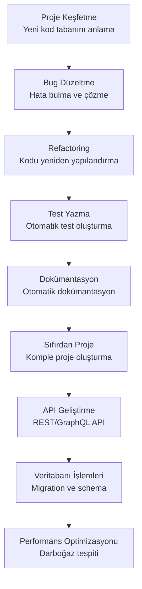
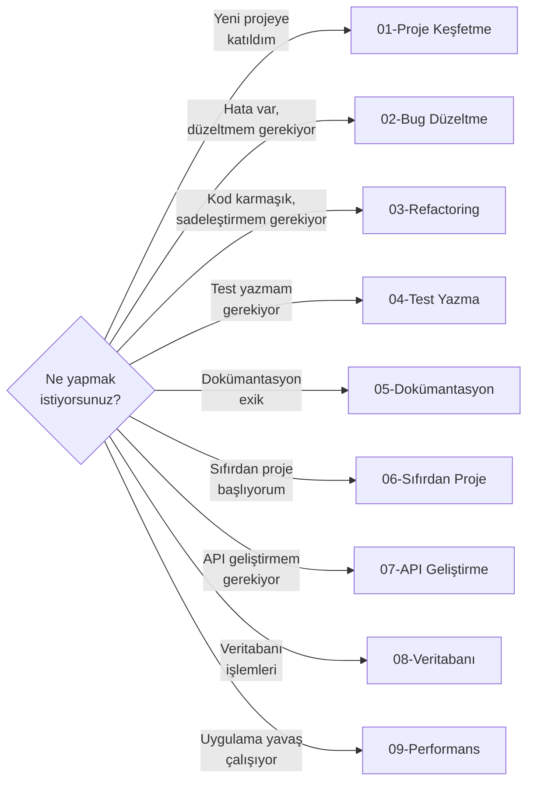

# Bölüm 20: Pratik Senaryolar ve Tarifler

Bu bölüm, Claude Code ile gerçek dünya geliştirme senaryolarını adım adım ele alır. Her senaryo, baştan sona bir iş akışını terminal örnekleriyle gösterir ve hemen uygulayabileceğiniz tarifler sunar.

## Bu Bölümde Neler Öğreneceksiniz?

## İçerik

| # | Dosya | Konu | Süre |
|---|-------|------|------|
| 01 | [Proje Keşfetme](./01-proje-kesfetme.md) | Yeni kod tabanını anlama, mimari keşif | ~15 dk |
| 02 | [Bug Düzeltme](./02-bug-duzeltme.md) | Hata tespiti, kök neden analizi, düzeltme | ~18 dk |
| 03 | [Refactoring](./03-refactoring.md) | Büyük ölçekli yeniden yapılandırma | ~18 dk |
| 04 | [Test Yazma](./04-test-yazma.md) | Unit, integration, TDD iş akışı | ~15 dk |
| 05 | [Dokümantasyon Oluşturma](./05-dokumantasyon-olusturma.md) | README, API docs, inline comments | ~12 dk |
| 06 | [Sıfırdan Proje Oluşturma](./06-sifirdan-proje-olusturma.md) | Full stack web app adım adım | ~25 dk |
| 07 | [API Geliştirme](./07-api-gelistirme.md) | REST/GraphQL API tasarım ve uygulama | ~18 dk |
| 08 | [Veritabanı İşlemleri](./08-veritabani-islemleri.md) | Migration, schema, query optimizasyonu | ~15 dk |
| 09 | [Performans Optimizasyonu](./09-performans-optimizasyonu.md) | Darboğaz tespiti, profiling, iyileştirme | ~15 dk |

## Ön Koşullar

Bu bölümü okumadan önce aşağıdaki konulara aşina olmanız önerilir:

| Konu | Bölüm |
|------|-------|
| Claude Code nasıl çalışır | [Bölüm 06](../06-claude-code-tanitim/README.md) |
| Arayüz ve komutlar | [Bölüm 07](../07-arayuz-ve-komutlar/README.md) |
| Araçlar (Tools) | [Bölüm 08](../08-araclar/README.md) |
| Bellek ve bağlam | [Bölüm 09](../09-bellek-ve-baglam/README.md) |

## Nasıl Kullanılır?

Bu bölümdeki senaryoları iki şekilde kullanabilirsiniz:

1. **Sıralı Okuma** — Baştan sona tüm senaryoları okuyarak genel bir bakış kazanın
2. **İhtiyaca Göre** — İlgili senaryoyu doğrudan açarak hemen uygulayın

## Önceki Bölüm

← [19 - Rol Bazlı Kullanım Rehberleri](../19-rol-bazli-rehberler/README.md)

## Sonraki Adım

Bu bölümü tamamladıktan sonra → [21 - Sorun Giderme ve SSS](../21-sorun-giderme/README.md)
