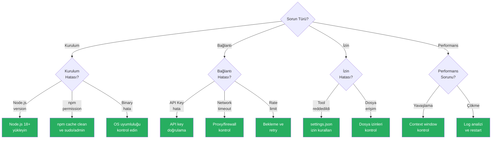

# Çok Karşılaşılan Sorunlar

Bu rehber, Claude Code kullanırken en çok karşılaşılan sorunları semptom, neden ve çözüm formatında ele alır. Her sorun için adım adım çözüm talimatları sunulur.

## Ön Koşullar

| Konu | Bölüm |
|------|-------|
| Claude Code kurulumu | [Kurulum ve Gereksinimler](../06-claude-code-tanitim/03-kurulum-ve-gereksinimler.md) |
| Kimlik doğrulama | [Kimlik Doğrulama](../06-claude-code-tanitim/04-kimlik-dogrulama.md) |

---

## Sorun Giderme Karar Ağacı



---

## 1. Kurulum Sorunları

### Sorun 1.1: Node.js Versiyon Hatası

**Semptom:**
```
Error: Claude Code requires Node.js 18 or later.
Current version: v16.14.0
```

**Neden:** Claude Code, Node.js 18+ gerektirir. Eski bir Node.js versiyonu yüklüdür.

**Çözüm:**
```bash
# Mevcut versiyonu kontrol et
node --version

# Node.js 18+ yükle (nvm ile)
nvm install 20
nvm use 20
nvm alias default 20

# Doğrula
node --version  # v20.x.x olmalı

# Claude Code'u yeniden yükle
npm install -g @anthropic-ai/claude-code
```

### Sorun 1.2: npm Permission Hatası

**Semptom:**
```
Error: EACCES: permission denied, mkdir '/usr/local/lib/node_modules'
```

**Neden:** Global npm paketleri için yazma izni yok.

**Çözüm:**

```bash
# Yöntem 1: npm global dizinini değiştir
mkdir ~/.npm-global
npm config set prefix '~/.npm-global'
export PATH="$HOME/.npm-global/bin:$PATH"
# .bashrc veya .zshrc dosyasına ekle

# Yöntem 2: nvm kullan (önerilen)
curl -o- https://raw.githubusercontent.com/nvm-sh/nvm/v0.39.0/install.sh | bash
nvm install 20
npm install -g @anthropic-ai/claude-code

# Windows'ta: PowerShell'i yönetici olarak çalıştır
# veya: npm install -g @anthropic-ai/claude-code --prefix "$env:APPDATA\npm"
```

### Sorun 1.3: Binary Uyumluluk Hatası

**Semptom:**
```
Error: Unsupported platform or architecture
```

**Neden:** İşletim sistemi veya CPU mimarisi desteklenmiyor.

**Çözüm:**
```bash
# Desteklenen platformları kontrol et
# macOS (Apple Silicon + Intel), Linux (x64, arm64), Windows (x64)

# Sistem bilgilerini kontrol et
uname -m   # Linux/macOS
# Windows: systeminfo | findstr /C:"System Type"

# Doğru platform için yeniden yükle
npm install -g @anthropic-ai/claude-code --force
```

---

## 2. Bağlantı Sorunları

### Sorun 2.1: API Key Hatası

**Semptom:**
```
Error: Invalid API key provided
Error: Authentication failed
```

**Neden:** API anahtarı geçersiz, süresi dolmuş veya tanımlanmamış.

**Çözüm:**
```bash
# API key'i kontrol et
echo $ANTHROPIC_API_KEY   # Linux/macOS
echo $env:ANTHROPIC_API_KEY  # Windows PowerShell

# API key'i yeniden ayarla
export ANTHROPIC_API_KEY="YOUR_API_KEY_HERE"  # Linux/macOS
$env:ANTHROPIC_API_KEY = "YOUR_API_KEY_HERE"  # Windows PowerShell

# Doğrulama yöntemini kontrol et
claude config list

# Alternatif: Tarayıcı tabanlı kimlik doğrulama
claude login
```

### Sorun 2.2: Network Timeout

**Semptom:**
```
Error: Request timed out
Error: ECONNREFUSED
Error: ETIMEDOUT
```

**Neden:** Ağ bağlantısı engellenmiş, proxy ayarları hatalı veya firewall kısıtlaması.

**Çözüm:**
```bash
# Bağlantı testi
curl -I https://api.anthropic.com/v1/messages

# Proxy ayarları (kurumsal ağlarda)
export HTTP_PROXY="http://proxy.company.com:8080"
export HTTPS_PROXY="http://proxy.company.com:8080"
export NO_PROXY="localhost,127.0.0.1"

# Windows PowerShell
$env:HTTP_PROXY = "http://proxy.company.com:8080"
$env:HTTPS_PROXY = "http://proxy.company.com:8080"

# DNS kontrolü
nslookup api.anthropic.com

# Firewall kontrolü: api.anthropic.com:443 portuna erişim olmalı
```

### Sorun 2.3: Rate Limiting

**Semptom:**
```
Error: 429 Too Many Requests
Error: Rate limit exceeded
```

**Neden:** API istek limiti aşılmış.

**Çözüm:**
```bash
# Birkaç dakika bekleyin ve tekrar deneyin

# Rate limit durumunu kontrol et
# Anthropic Console'dan kullanım istatistiklerini inceleyin

# Çözüm önerileri:
# 1. İstekler arasında bekleme süresi ekleyin
# 2. Daha yüksek limitle plan yükseltin
# 3. /compact ile gereksiz context'i azaltın
# 4. Daha kısa, odaklı oturumlar kullanın
```

---

## 3. İzin Sorunları

### Sorun 3.1: Tool Permission Denied

**Semptom:**
```
Permission denied: Tool 'Bash' is not allowed
```

**Neden:** İzin kuralları aracın kullanımını engelliyor.

**Çözüm:**
```bash
# Mevcut izin ayarlarını kontrol et
claude config list

# İzin modunu kontrol et
# settings.json dosyasında:
# "permissions": { "allow": ["Bash", "Edit", "Read", "Write"] }

# Geçici olarak izin ver (oturum bazlı)
# Claude Code başlatılırken --allowedTools flag'i kullanılabilir

# Kalıcı çözüm: settings.json'da izin kuralını ekle
# ~/.claude/settings.json (global)
# .claude/settings.json (proje)
```

### Sorun 3.2: Dosya Erişim Hatası

**Semptom:**
```
Error: EACCES: permission denied, open '/path/to/file'
Error: EPERM: operation not permitted
```

**Neden:** Dosya sistemi izinleri yetersiz.

**Çözüm:**
```bash
# Dosya izinlerini kontrol et
ls -la /path/to/file   # Linux/macOS

# İzinleri düzelt
chmod 644 /path/to/file      # Dosya
chmod 755 /path/to/directory  # Dizin

# Windows'ta: Dosya özelliklerinden güvenlik sekmesinde izinleri kontrol edin

# Claude Code'un çalışma dizinini kontrol et
pwd
```

---

## 4. Performans Sorunları

### Sorun 4.1: Genel Yavaşlama

**Semptom:** Claude Code yanıtları gittikçe yavaşlıyor, birkaç dakika bekleme süresi.

**Neden:** Context window dolmuş, çok fazla dosya okunmuş veya karmaşık görev.

**Çözüm:**
```bash
# Context durumunu kontrol et
# Token kullanım göstergesi yüksekse:

# 1. Context'i sıkıştır
> /compact

# 2. Yeni oturum başlat
> /clear
# veya terminal'de yeni claude oturumu aç

# 3. Görevleri parçalara böl
# Büyük görevler yerine küçük, odaklı görevler ver

# 4. CLAUDE.md'yi optimize et
# Gereksiz bilgileri kaldır, özlü tut
```

### Sorun 4.2: Hatalı veya Alakasız Yanıtlar

**Semptom:** Claude Code yanlış dosyaları düzenliyor, konudan sapıyor veya anlamsız yanıtlar veriyor.

**Neden:** Context karmaşık, talimatlar belirsiz veya context window kirlendi.

**Çözüm:**
```bash
# 1. Yeni oturum başlat
> /clear

# 2. Daha spesifik talimat ver
# Kötü: "Kodu düzelt"
# İyi: "src/services/auth.ts dosyasındaki login fonksiyonundaki null pointer hatasını düzelt"

# 3. CLAUDE.md ile bağlam sağla
# Projenin yapısını ve kurallarını tanımla

# 4. /compact ile temizle ve özet ver
> /compact "Auth modülünde login fonksiyonunu düzeltiyorum"
```

### Sorun 4.3: Claude Code Çökmesi

**Semptom:** Claude Code beklenmedik şekilde kapanıyor veya yanıt vermiyor.

**Neden:** Bellek yetersizliği, ağ kesintisi veya yazılım hatası.

**Çözüm:**
```bash
# 1. Claude Code'u yeniden başlat
claude

# 2. Cache'i temizle
claude config clear-cache

# 3. Güncel versiyona güncelle
npm update -g @anthropic-ai/claude-code

# 4. Debug modu ile çalıştır
claude --debug

# 5. Log dosyalarını kontrol et
# ~/.claude/logs/ dizinindeki son log dosyasını inceleyin
```

---

## 5. Model Hataları

### Sorun 5.1: Context Length Exceeded

**Semptom:**
```
Error: Maximum context length exceeded
```

**Neden:** Tek bir istekte çok fazla veri gönderilmiş.

**Çözüm:**
```bash
# 1. Daha küçük dosyalarla çalış
# Tüm projeyi değil, ilgili dosyaları hedefle

# 2. /compact kullan
> /compact

# 3. Görevleri parçala
# "Tüm projeyi analiz et" yerine "src/auth/ dizinini analiz et"
```

### Sorun 5.2: Model Timeout

**Semptom:**
```
Error: Model response timed out
```

**Neden:** Çok karmaşık görev, model yanıt üretmekte zorlanıyor.

**Çözüm:**
```bash
# 1. Görevi basitleştir
# Karmaşık görevi daha küçük parçalara böl

# 2. Daha az dosya referans et
# Sadece ilgili dosyaları belirt

# 3. Tekrar dene
# Aynı isteği tekrar gönder, bazen geçici sorun olabilir
```

---

## Sorun Bildirme

Eğer yukarıdaki çözümler işe yaramazsa:

1. **Debug log'ları toplayın:** `claude --debug` ile çalıştırın
2. **Ortam bilgilerini not alın:** OS, Node.js versiyonu, Claude Code versiyonu
3. **Sorunu minimal şekilde tekrarlayın:** En az adımla hatayı oluşturun
4. **GitHub Issues'a bildirin:** [github.com/anthropics/claude-code/issues](https://github.com/anthropics/claude-code/issues)

---

## Özet

| Sorun Kategorisi | Yaygın Çözüm |
|------------------|--------------|
| **Kurulum** | Node.js 18+, npm izinleri |
| **Bağlantı** | API key, proxy, firewall |
| **İzin** | settings.json izin kuralları |
| **Performans** | /compact, görev parçalama, yeni oturum |
| **Model** | Görev basitleştirme, context azaltma |

---

## Sonraki Adım

Context window sorunlarına özel detaylı rehber:

→ [Context Window Sorunları](./02-context-window-sorunlari.md)
