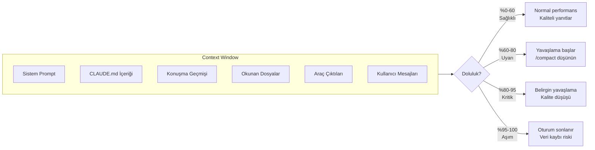
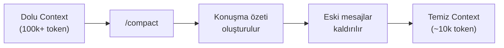
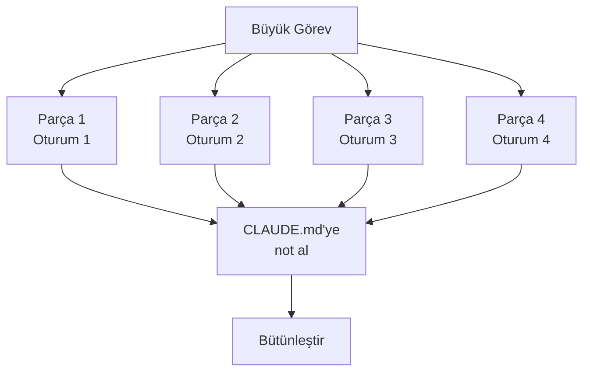
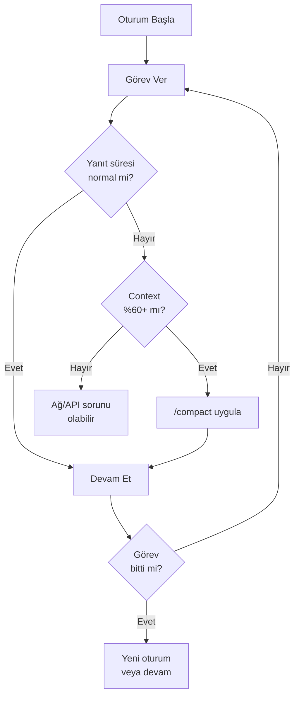

# Context Window Sorunları

Context window (bağlam penceresi), Claude Code'un bir oturumda işleyebildiği bilgi miktarını belirler. Bu pencere dolduğunda performans düşer, yanıtlar kalitesizleşir ve oturum sonlanabilir. Bu rehber, context window sorunlarını tanıma, önleme ve çözme stratejilerini kapsar.

## Ön Koşullar

| Konu | Bölüm |
|------|-------|
| Context Window yönetimi | [Context Window Yönetimi](../09-bellek-ve-baglam/05-context-window-yonetimi.md) |
| Oturum yönetimi | [Oturum Yönetimi](../09-bellek-ve-baglam/06-oturum-yonetimi.md) |

---

## Context Window Neden Önemli?



---

## Belirtiler ve Tanı

### Context Doluluk Belirtileri

| Belirtiye | Seviye | Aksiyon |
|----------|--------|---------|
| Yanıtlar normalden uzun sürüyor | Uyarı | `/compact` düşünün |
| Claude daha önce verdiğiniz bilgiyi soruyor | Yüksek | `/compact` uygulayın |
| Yanıtlar kısa ve genel oluyor | Yüksek | `/compact` veya yeni oturum |
| Yanlış dosyayı düzenliyor | Kritik | Yeni oturum başlatın |
| "Context length exceeded" hatası | Aşım | Yeni oturum zorunlu |
| Oturum yanıt vermeden donuyor | Aşım | Yeni oturum zorunlu |

---

## Çözüm Stratejileri

### Strateji 1: /compact ile Sıkıştırma

```bash
# Basit sıkıştırma
> /compact

# Bağlamlı sıkıştırma (önerilen)
> /compact "Kullanıcı authentication modülünü refactor ediyorum. Login ve register servislerini ayırdım, OAuth entegrasyonu kaldı."
```

`/compact` ne yapar:



**Ne zaman kullanmalı:**
- Context %60-80 arasına geldiğinde
- Konuşma konusu değiştiğinde
- Büyük dosya okumaları yapıldıktan sonra

**Ne zaman kullanmamalı:**
- Context zaten düşükse (gereksiz bilgi kaybı)
- Kritik teknik detaylar konuşmada varsa (kaybolabilir)

### Strateji 2: Görev Parçalama (Task Chunking)

Büyük görevleri bağımsız oturumlara bölün:

```bash
# Kötü: Tek oturumda her şeyi yapmaya çalışmak ❌
claude "Tüm uygulamayı TypeScript'e geçir, testleri yaz, dokümantasyonu güncelle"

# İyi: Parçalara bölmek ✅

# Oturum 1: Analiz
claude "TypeScript migration için bir plan oluştur. Dosyaları bağımlılık sırasına göre listele."

# Oturum 2: Temel dosyalar
claude "src/utils/ dizinindeki dosyaları TypeScript'e çevir. Tip tanımlarını types/ dizinine yaz."

# Oturum 3: Service katmanı
claude "src/services/ dizinindeki dosyaları TypeScript'e çevir. types/ dizinindeki mevcut tipleri kullan."

# Oturum 4: Test
claude "Dönüştürülen dosyalar için TypeScript testleri yaz."
```



### Strateji 3: --worktree ile İzolasyon

```bash
# Her görevi ayrı worktree'de çalıştır
claude --worktree task/auth "Auth modülünü refactor et"
claude --worktree task/api "API endpoint'lerini güncelle"
claude --worktree task/tests "Eksik testleri yaz"
```

Her worktree bağımsız context window'a sahiptir, böylece birbirlerini kirletmezler.

### Strateji 4: Yeni Oturum

Bazen en iyi çözüm temiz bir başlangıçtır:

```bash
# Mevcut oturumdan çık
> /quit
# veya Ctrl+C

# Yeni oturum başlat
claude

# Bağlam bilgisi ver
> "src/auth/ dizinindeki login fonksiyonunu düzeltmeye devam ediyorum. Sorun: OAuth token parse hatası. Şu ana kadar token validation kısmını düzelttim, callback handler kaldı."
```

### Strateji 5: CLAUDE.md Optimizasyonu

CLAUDE.md dosyanız context'ten yer kaplar. Optimize edin:

```bash
# Kötü CLAUDE.md: Çok uzun, gereksiz detaylar ❌
# Tüm meeting notları, her dosyanın açıklaması, uzun kod örnekleri

# İyi CLAUDE.md: Özlü, sadece kurallar ✅
# Mimari kurallar, naming convention, yasaklar, kısa referanslar
```

| CLAUDE.md Öğesi | Sakla | Kaldır |
|------------------|-------|--------|
| Mimari kurallar | ✅ | |
| Naming convention | ✅ | |
| Yasaklar (anti-patterns) | ✅ | |
| Uzun kod örnekleri | | ❌ |
| Toplantı notları | | ❌ |
| Dosya bazında açıklamalar | | ❌ |
| Tüm API endpoint listesi | | ❌ |

---

## Context Sağlık İzleme Rehberi

### Günlük İzleme



### Proaktif Context Yönetimi

| Kural | Açıklama |
|-------|----------|
| Bir oturumda tek görev | Her oturumda tek bir ana göreve odaklanın |
| Büyük dosya okumasından sonra /compact | 1000+ satır dosya okuttuktan sonra sıkıştırın |
| Her 30 dakikada kontrol | Context durumunu periyodik kontrol edin |
| CLAUDE.md'yi kısa tutun | 200 satırın altında tutmaya çalışın |
| Çıktıları kısıtlayın | "İlk 50 satırı göster" gibi sınırlar koyun |

---

## Özet

| Strateji | Ne Zaman Kullanılır |
|----------|---------------------|
| **/compact** | Context %60-80 arasında |
| **Görev Parçalama** | Büyük, çok adımlı görevlerde |
| **--worktree** | Bağımsız paralel görevlerde |
| **Yeni Oturum** | Context %90+ veya konu tamamen değiştiğinde |
| **CLAUDE.md Optimizasyonu** | Sürekli context sorunu yaşanıyorsa |

---

## Sonraki Adım

Sıkça sorulan sorular ve yanıtları:

→ [SSS](./03-sss.md)
