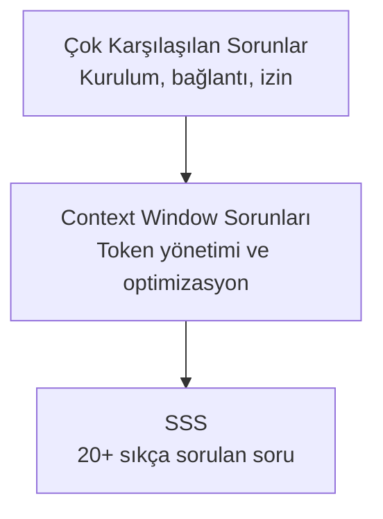
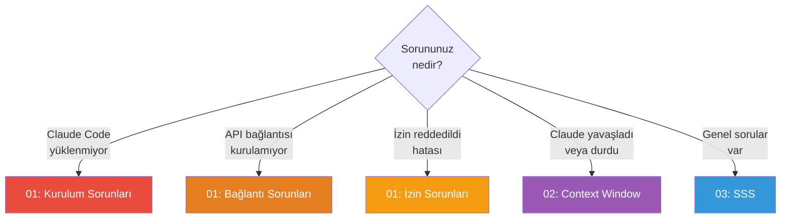

# Bölüm 21: Sorun Giderme ve SSS

Claude Code kullanırken karşılaşabileceğiniz sorunların çözümlerini ve sıkça sorulan soruların yanıtlarını bu bölümde bulabilirsiniz. Kurulum hatalarından context window sorunlarına, API bağlantı problemlerinden performans düşüşüne kadar her konuyu kapsar.

## Bu Bölümde Neler Öğreneceksiniz?

## İçerik

| # | Dosya | Konu | Süre |
|---|-------|------|------|
| 01 | [Çok Karşılaşılan Sorunlar](./01-cok-sorulan-sorunlar.md) | Kurulum, bağlantı, izin, performans sorunları | ~15 dk |
| 02 | [Context Window Sorunları](./02-context-window-sorunlari.md) | Token taşması, oturum yönetimi, optimizasyon | ~12 dk |
| 03 | [SSS](./03-sss.md) | 20+ sıkça sorulan soru ve yanıt | ~15 dk |

## Ön Koşullar

Bu bölümü okumadan önce aşağıdaki konulara aşina olmanız önerilir:

| Konu | Bölüm |
|------|-------|
| Claude Code kurulumu | [Bölüm 06](../06-claude-code-tanitim/README.md) |
| Arayüz ve komutlar | [Bölüm 07](../07-arayuz-ve-komutlar/README.md) |
| Bellek ve bağlam | [Bölüm 09](../09-bellek-ve-baglam/README.md) |

## Hızlı Sorun Çözme

## Önceki Bölüm

← [20 - Pratik Senaryolar ve Tarifler](../20-pratik-senaryolar/README.md)
