# Claude Code Handbook

Yapay zeka hakkında hiçbir şey bilmeyen birinden, Claude Code'u profesyonel düzeyde kullanan bir yazılım ekibine kadar uzanan kapsamlı Türkçe rehber.

> **Not:** Teknik terimler sektörde kullanıldığı şekliyle İngilizce bırakılmış, ilk geçtikleri yerde Türkçe karşılıkları parantez içinde verilmiştir.

---

## Bu Rehber Kimin İçin?

| Rol | Başlangıç Noktası | Odak Bölümleri |
|-----|-------------------|----------------|
| **Yapay zekaya yeni başlayan** | Bölüm 01'den başlayın | 01 → 05 |
| **Yazılımcı** | Bölüm 06'dan başlayabilirsiniz | 06 → 14, 20 |
| **Yazılım Mimarı** | Bölüm 04'ten başlayabilirsiniz | 04, 09, 13, 17, 18, 19 |
| **İş Analisti** | Bölüm 01'den başlayın | 01 → 05, 19 |
| **Vibe Coder** | Bölüm 04'ten başlayabilirsiniz | 04, 06, 07, 08, 19, 20 |

---

## İçindekiler

### Temel Bilgiler

- **[01 - Yapay Zeka Temelleri](./01-yapay-zeka-temelleri/README.md)**
  Yapay zeka nedir, Machine Learning, Deep Learning, NLP, Transformer mimarisi ve temel kavramlar sözlüğü.

- **[02 - Büyük Dil Modelleri (LLM)](./02-buyuk-dil-modelleri/README.md)**
  LLM nedir, nasıl çalışır, tarihçe, Mart 2026 güncel modeller, açık/kapalı kaynak karşılaştırma, değerlendirme kriterleri.

- **[03 - LLM Sağlayıcıları ve Karşılaştırma](./03-llm-saglayicilari/README.md)**
  OpenAI, Anthropic, Google DeepMind, Meta, DeepSeek, Mistral ve büyük karşılaştırma tablosu.

### AI Destekli Geliştirme

- **[04 - Yapay Zeka Destekli Yazılım Geliştirme](./04-ai-destekli-gelistirme/README.md)**
  AI Agent, Agentic Workflow, Vibe Coding, Prompt Engineering ve AI kodlama araçları karşılaştırması.

- **[05 - Claude Ekosistemi](./05-claude-ekosistemi/README.md)**
  Claude AI, model ailesi (Haiku/Sonnet/Opus), API ve SDK kullanımı, özel yetenekler.

### Claude Code

- **[06 - Claude Code: Tanıtım ve Kurulum](./06-claude-code-tanitim/README.md)**
  Claude Code nedir, nasıl çalışır, kurulum, kimlik doğrulama, ilk oturum ve Claude AI ile farkları.

- **[07 - Claude Code: Arayüz ve Komutlar](./07-arayuz-ve-komutlar/README.md)**
  Interactive Mode, Plan Mode, Fast Mode, CLI referansı, Slash komutları ve çıktı stilleri.

- **[08 - Claude Code: Araçlar (Tools)](./08-araclar/README.md)**
  30+ dahili araç detaylı: dosya işlemleri, Bash, web erişimi, görev yönetimi, LSP, Notebook ve daha fazlası.

- **[09 - Claude Code: Bellek ve Bağlam Yönetimi](./09-bellek-ve-baglam/README.md)**
  CLAUDE.md, AGENTS.md, Rules, Auto Memory, Context Window yönetimi, oturum yönetimi, Checkpointing, Worktree.

- **[10 - Claude Code: İzinler ve Güvenlik](./10-izinler-ve-guvenlik/README.md)**
  Permission sistemi, izin kuralları, izin modları, Sandboxing ve güvenlik en iyi uygulamaları.

### Claude Code Genişletme

- **[11 - MCP (Model Context Protocol)](./11-mcp/README.md)**
  MCP nedir, kurulum ve konfigürasyon, hazır sunucular, Tool Search, MCP vs Skills karşılaştırması.

- **[12 - Skills ve Pluginler](./12-skills-ve-pluginler/README.md)**
  Skill sistemi, Skill oluşturma, Plugin mimarisi, Marketplace ve dağıtım.

- **[13 - Subagent'lar ve Agent Takımları](./13-subagentlar-ve-agent-takimlari/README.md)**
  Subagent nedir, dahili subagent'lar, özel subagent oluşturma, Agent Teams ve Agent Tool.

- **[14 - Hooks ve Otomasyon](./14-hooks-ve-otomasyon/README.md)**
  Hook sistemi, 17 hook event, hook tipleri (Command/HTTP/Prompt), konfigürasyon ve pratik örnekler.

### Entegrasyon ve Operasyon

- **[15 - IDE ve Platform Entegrasyonları](./15-entegrasyonlar/README.md)**
  VS Code, JetBrains, Cursor, Desktop uygulaması, Chrome, Slack, Remote Control ve Web.

- **[16 - CI/CD ve DevOps](./16-cicd-ve-devops/README.md)**
  GitHub Actions, GitLab CI/CD, otomatik kod inceleme, Headless Mode ve SDK, otomasyon tarifleri.

- **[17 - Konfigürasyon ve Ayarlar](./17-konfigurasyon/README.md)**
  Ayar dosyaları hiyerarşisi, settings.json, ortam değişkenleri, model konfigürasyonu, maliyet yönetimi.

- **[18 - Kurumsal Kullanım](./18-kurumsal-kullanim/README.md)**
  Takım yönetimi, analitik, OpenTelemetry, ağ/proxy, LLM Gateway, DevContainer, veri güvenliği.

### Pratik Rehberler

- **[19 - Rol Bazlı Kullanım Rehberleri](./19-rol-bazli-rehberler/README.md)**
  Yazılımcı, yazılım mimarı, iş analisti ve Vibe Coder için özel rehberler.

- **[20 - Pratik Senaryolar ve Tarifler](./20-pratik-senaryolar/README.md)**
  Proje keşfetme, bug düzeltme, refactoring, test yazma, dokümantasyon, sıfırdan proje ve daha fazlası.

- **[21 - Sorun Giderme ve SSS](./21-sorun-giderme/README.md)**
  Çok karşılaşılan sorunlar, Context Window sorunları ve sıkça sorulan sorular.

---

## Nasıl Okunmalı?

```mermaid
flowchart LR
    subgraph temel ["Temel Bilgiler"]
        A["01\nYapay Zeka\nTemelleri"] --> B["02\nBüyük Dil\nModelleri"]
        B --> C["03\nLLM\nSağlayıcıları"]
    end

    subgraph gecis ["AI Geliştirme"]
        D["04\nAI Destekli\nGeliştirme"] --> E["05\nClaude\nEkosistemi"]
    end

    subgraph ccode ["Claude Code"]
        F["06\nTanıtım ve\nKurulum"] --> G["07\nArayüz ve\nKomutlar"]
        G --> H["08\nAraçlar"]
        H --> I["09\nBellek ve\nBağlam"]
        I --> J["10\nİzinler ve\nGüvenlik"]
    end

    subgraph genisletme ["Genişletme"]
        K["11\nMCP"] --> L["12\nSkills ve\nPluginler"]
        L --> M["13\nSubagent'lar"]
        M --> N["14\nHooks"]
    end

    subgraph operasyon ["Operasyon"]
        O["15\nEntegrasyonlar"] --> P["16\nCI/CD"]
        P --> Q["17\nKonfigürasyon"]
        Q --> R["18\nKurumsal"]
    end

    subgraph pratik ["Pratik"]
        S["19\nRol Bazlı\nRehberler"] --> T["20\nSenaryolar"]
        T --> U["21\nSorun\nGiderme"]
    end

    C --> D
    E --> F
    J --> K
    N --> O
    R --> S
```

> **İpucu:** Sıralı okumak en iyi deneyimi sağlar, ancak her bölüm kendi başına da okunabilir. Her dosyanın başında "Ön Koşullar" bölümü hangi konuları bilmeniz gerektiğini belirtir.

---

## Güncellik

Bu rehber **Mart 2026** verileriyle hazırlanmıştır. Model isimleri, benchmark sonuçları ve fiyatlandırma bilgileri bu tarihe aittir.

---

## Katkıda Bulunma

Katkıda bulunmak için [CONTRIBUTING.md](./CONTRIBUTING.md) dosyasını inceleyin.

## Lisans

Bu proje MIT lisansı altında sunulmaktadır. Detaylar için [LICENSE](./LICENSE) dosyasına bakınız.
