# Claude Code Handbook

Bu rehberde, yapay zeka dünyasını ve Claude Code kullanımını Türkçe olarak anlaşılır ve pratik bir şekilde bir araya getiren kapsamlı bir kaynaktır. İster konuya yeni başlıyor olun ister günlük iş akışınızda AI’dan daha fazla faydalanmak isteyin, içerikler sizi adım adım ilerletecek şekilde tasarlanmıştır.

## Kısaca

Bu rehberde;

- Yapay zeka ve LLM kavramlarını
- Claude Code kullanımını
- AI destekli geliştirme süreçlerini
- Gerçek iş senaryolarında AI kullanımını

**sıfırdan başlayarak pratik şekilde öğrenebileceğiniz Türkçe bir kaynak sunar.**

İster teknik bir rolde olun ister ürün, analiz veya operasyon tarafında çalışıyor olun, içerikler AI’ı günlük iş akışınıza entegre etmenize yardımcı olacak şekilde tasarlanmıştır.

## Proje Hakkında

Bu proje, yapay zeka dünyasını ve Claude Code kullanımını Türkçe olarak anlaşılır ve sistematik bir şekilde anlatmak amacıyla hazırlanmıştır. İçerik; temel yapay zeka kavramlarından başlayarak LLM ekosistemine, Claude Code kullanımına ve gerçek iş senaryolarına kadar adım adım ilerler.

Her bölüm bağımsız olarak okunabilecek şekilde yapılandırılmıştır. Böylece ister konuyu baştan öğrenebilir ister doğrudan ihtiyaç duyduğunuz bölüme geçebilirsiniz.

---

## Bu Rehber Kimin İçin?

Bölüm 01–04 yapay zeka, LLM ve AI destekli geliştirme gibi temel ve tarihsel bilgileri içerir. AI konusuna yeni olan herkes bu bölümlerle başlayabilir. Sonraki bölümler doğrudan Claude Code kullanımına odaklanır.

| Birim | Pozisyonlar | Nereden Başlamalı? | Odak Bölümleri |
|-------|------------|-------------------|----------------|
| **Teknik** | Yazılım Geliştirici, QA / Test, Sistem Uzmanı, UI/UX | Bölüm 06 | 06–14, 19, 20 |
| **Ürün & Analiz** | Ürün Müdürü, İş Analisti, Proje Yöneticisi | Bölüm 01 | 01–05, 08, 19, 20 |
| **Ticari** | Satış, Pazarlama | Bölüm 01 | 01–05, 19 |
| **Operasyon** | İK, Finans, Yönetim | Bölüm 01 | 01–05, 17, 18, 19 |

> Teknik birim zaten AI ve yazılım geliştirme süreçlerine aşina olduğu için doğrudan Bölüm 06'dan başlayabilir. Diğer birimler için Bölüm 01–04 arası temel kavramları anlamak faydalı olacaktır.

---

## İçindekiler

### Temel Bilgiler

- **[01 - Yapay Zeka Temelleri](./01-yapay-zeka-temelleri/README.md)**
  Yapay zeka nedir, Machine Learning, Deep Learning, NLP, Transformer mimarisi ve temel kavramlar sözlüğü.

- **[02 - Büyük Dil Modelleri (LLM)](./02-buyuk-dil-modelleri/README.md)**
  LLM nedir, nasıl çalışır, tarihçe, Mart 2026 güncel modeller, açık/kapalı kaynak karşılaştırma, değerlendirme kriterleri.

- **[03 - LLM Sağlayıcıları ve Karşılaştırma](./03-llm-saglayicilari/README.md)**
  OpenAI, Anthropic, Google DeepMind, Meta, DeepSeek, Mistral ve büyük karşılaştırma tablosu.

### AI Destekli Geliştirme

- **[04 - Yapay Zeka Destekli Yazılım Geliştirme](./04-ai-destekli-gelistirme/README.md)**
  AI Agent, Agentic Workflow, Vibe Coding, Prompt Engineering ve AI kodlama araçları karşılaştırması.

- **[05 - Claude Ekosistemi](./05-claude-ekosistemi/README.md)**
  Claude AI, model ailesi (Haiku/Sonnet/Opus), API ve SDK kullanımı, özel yetenekler.

### Claude Code

- **[06 - Claude Code: Tanıtım ve Kurulum](./06-claude-code-tanitim/README.md)**
  Claude Code nedir, nasıl çalışır, kurulum, kimlik doğrulama, ilk oturum ve Claude AI ile farkları.

- **[07 - Claude Code: Arayüz ve Komutlar](./07-arayuz-ve-komutlar/README.md)**
  Interactive Mode, Plan Mode, Fast Mode, CLI referansı, Slash komutları ve çıktı stilleri.

- **[08 - Claude Code: Araçlar (Tools)](./08-araclar/README.md)**
  30+ dahili araç: dosya işlemleri, Bash, web erişimi, görev yönetimi, LSP, Notebook.

- **[09 - Claude Code: Bellek ve Bağlam Yönetimi](./09-bellek-ve-baglam/README.md)**
  CLAUDE.md, AGENTS.md, Rules, Auto Memory, Context Window yönetimi, oturum yönetimi, Checkpointing, Worktree.

- **[10 - Claude Code: İzinler ve Güvenlik](./10-izinler-ve-guvenlik/README.md)**
  Permission sistemi, izin kuralları, izin modları, Sandboxing ve güvenlik uygulamaları.

### Claude Code Genişletme

- **[11 - MCP (Model Context Protocol)](./11-mcp/README.md)**
  MCP nedir, kurulum ve konfigürasyon, hazır sunucular, Tool Search, MCP vs Skills karşılaştırması.

- **[12 - Skills ve Pluginler](./12-skills-ve-pluginler/README.md)**
  Skill sistemi, Skill oluşturma, Plugin mimarisi, Marketplace ve dağıtım.

- **[13 - Subagent'lar ve Agent Takımları](./13-subagentlar-ve-agent-takimlari/README.md)**
  Subagent nedir, dahili subagent'lar, özel subagent oluşturma, Agent Teams ve Agent Tool.

- **[14 - Hooks ve Otomasyon](./14-hooks-ve-otomasyon/README.md)**
  Hook sistemi, hook event'leri, hook tipleri (Command/HTTP/Prompt), konfigürasyon ve örnekler.

### Entegrasyon ve Operasyon

- **[15 - IDE ve Platform Entegrasyonları](./15-entegrasyonlar/README.md)**
  VS Code, JetBrains, Cursor, Desktop uygulaması, Chrome, Slack, Remote Control ve Web.

- **[16 - CI/CD ve DevOps](./16-cicd-ve-devops/README.md)**
  GitHub Actions, GitLab CI/CD, otomatik kod inceleme, Headless Mode ve SDK, otomasyon tarifleri.

- **[17 - Konfigürasyon ve Ayarlar](./17-konfigurasyon/README.md)**
  Ayar dosyaları hiyerarşisi, settings.json, ortam değişkenleri, model konfigürasyonu, maliyet yönetimi.

- **[18 - Kurumsal Kullanım](./18-kurumsal-kullanim/README.md)**
  Takım yönetimi, analitik, OpenTelemetry, ağ/proxy, LLM Gateway, DevContainer, veri güvenliği.

### Pratik Rehberler

- **[19 - Birim ve Pozisyon Bazlı Kullanım Rehberleri](./19-rol-bazli-rehberler/README.md)**
  Teknik, Ürün & Analiz, Ticari ve Operasyon birimleri için 12 pozisyon rehberi.

- **[20 - Pratik Senaryolar ve Tarifler](./20-pratik-senaryolar/README.md)**
  Proje keşfetme, bug düzeltme, refactoring, test yazma, dokümantasyon, sıfırdan proje.

- **[21 - Sorun Giderme ve SSS](./21-sorun-giderme/README.md)**
  Sık karşılaşılan sorunlar, Context Window sorunları ve sıkça sorulan sorular.

---

## Okuma Sırası

```mermaid
flowchart LR
    subgraph temel ["Temel Bilgiler"]
        A["01<br/>Yapay Zeka<br/>Temelleri"] --> B["02<br/>Büyük Dil<br/>Modelleri"]
        B --> C["03<br/>LLM<br/>Sağlayıcıları"]
    end

    subgraph gecis ["AI Geliştirme"]
        D["04<br/>AI Destekli<br/>Geliştirme"] --> E["05<br/>Claude<br/>Ekosistemi"]
    end

    subgraph ccode ["Claude Code"]
        F["06<br/>Tanıtım ve<br/>Kurulum"] --> G["07<br/>Arayüz ve<br/>Komutlar"]
        G --> H["08<br/>Araçlar"]
        H --> I["09<br/>Bellek ve<br/>Bağlam"]
        I --> J["10<br/>İzinler ve<br/>Güvenlik"]
    end

    subgraph genisletme ["Genişletme"]
        K["11<br/>MCP"] --> L["12<br/>Skills ve<br/>Pluginler"]
        L --> M["13<br/>Subagent'lar"]
        M --> N["14<br/>Hooks"]
    end

    subgraph entOps ["Operasyon"]
        O["15<br/>Entegrasyonlar"] --> P["16<br/>CI/CD"]
        P --> Q["17<br/>Konfigürasyon"]
        Q --> R["18<br/>Kurumsal"]
    end

    subgraph pratik ["Pratik"]
        S["19<br/>Birim Bazlı<br/>Rehberler"] --> T["20<br/>Senaryolar"]
        T --> U["21<br/>Sorun<br/>Giderme"]
    end

    C --> D
    E --> F
    J --> K
    N --> O
    R --> S
```

Her bölüm kendi başına da okunabilir. Dosyaların başındaki "Ön Koşullar" bölümü gerekli ön bilgileri belirtir.

---

## Güncellik

Mart 2026 verileriyle hazırlanmıştır.

---

## Katkıda Bulunma

[CONTRIBUTING.md](./CONTRIBUTING.md)

## Lisans

MIT — [LICENSE](./LICENSE)
